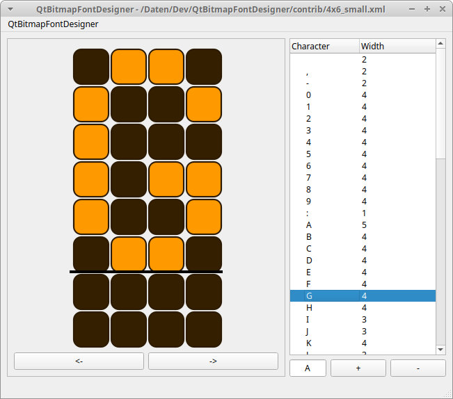

QtBitmapFontDesigner
====================

This applications aims to be a simple but already useful tool for designing
bitmap fonts.

There might be other tools available for the purpose, but this tool especially allows to generate a Qt resource file along with the individual resources.

The resources include a manifest XML file which describes each bitmap font and a number of PNG files with the individual characters.

A software could use this resources to print to small sized monochromatic screens like LED displays where using vectorized fonts is not appropriate.

The software comes with no warranty and no liability. See LICENSE for further information.

Features
--------

- Support for font heights 4 px up to 28 px
- Support for fixed and variable font widths
- Support for defining a common baseline to support descenders properly
- Support for Unicode characters, which allows to include graphics and icons
- Easy-to-read XML project file format
- Support for exporting fonts to Qt resources (QRC file format) along with the resources (XML manifest and PNG files)

Caveats
-------

- The user interface does not adhere to modern standards
- Characters can be drawn only pixel by pixel using a pointing device (thus no keyboard support)
- The font metrics cannot be changed, the height is fixed for a font
- Exporting a font entirely removes a subfolder named like the QRC file (without filename extension), which could lead to loss of data!